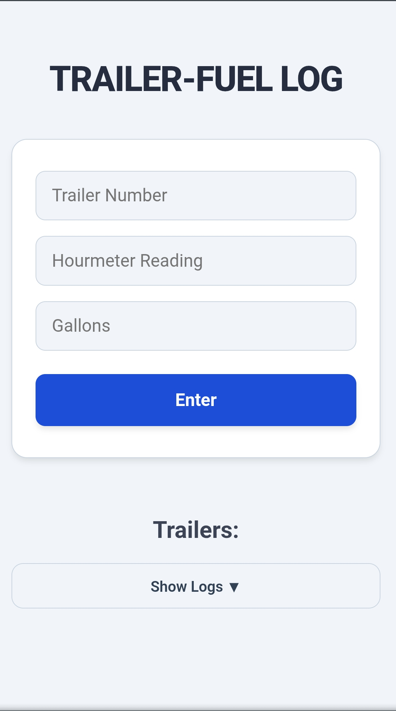
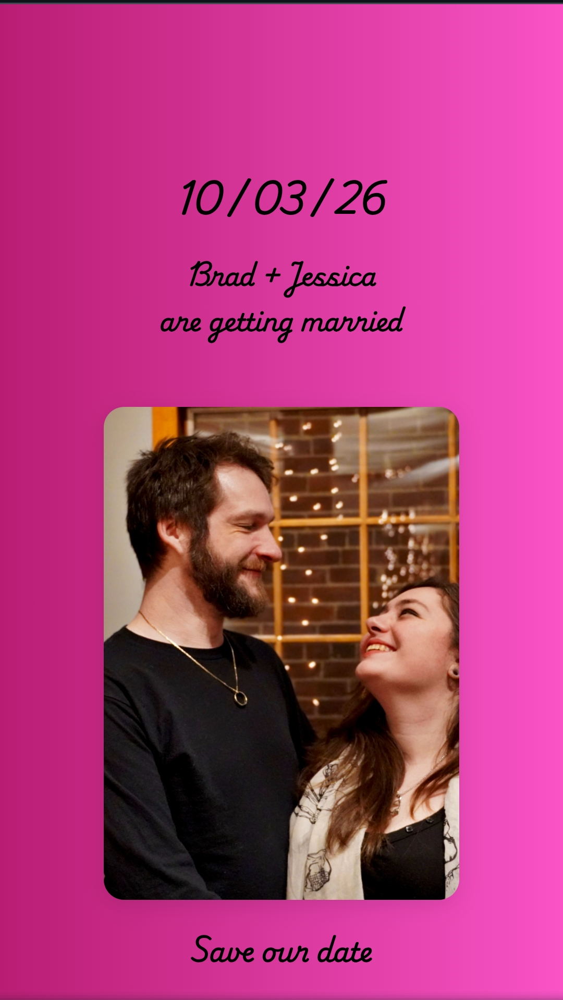
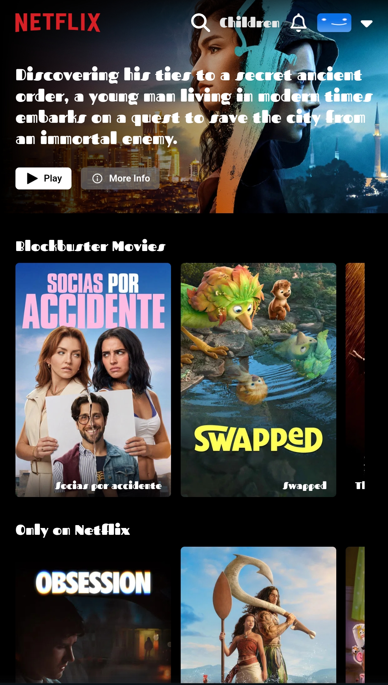

# PRWS-CODING | Personal Portfolio

A personal portfolio website built from the ground up to showcase my skills, projects, and professional background. This project serves as a central hub for my work, designed with a focus on performance, custom styling, and a unique user experience.

React,TypeScript,Vite,Vercel

**Live Site: [your-portfolio-url.vercel.app](https://your-portfolio-url.vercel.app/)**


---

## 🛠️ Key Features

- **Interactive 3D Model:** Integrates a `react-three-fiber` component to render a 3D dragon model, with a graceful fallback to a static image on devices that do not support WebGL.
- **Custom UI/UX:** The entire user interface is built from scratch using **Native CSS3** and **CSS Modules**. This approach avoids reliance on heavy component libraries, resulting in a fast, lightweight, and completely custom design.
- **Project Showcase:** Dynamically renders a list of my key projects, complete with descriptions, tech stacks, and direct links to live demos and GitHub repositories.
- **Responsive Design:** Meticulously styled to provide a seamless experience across all devices, from mobile phones to desktop monitors.
- **Modern Tech Stack:** Built with a modern frontend stack including **React**, **TypeScript**, and **Vite** for a fast development experience and an optimized production build.

## 🧰 Technology Stack

- **Frontend:** React, TypeScript, CSS Modules
- **3D Rendering:** React Three Fiber, Three.js
- **Build Tool:** Vite
- **Deployment:** Vercel

## 🚀 Getting Started

To get a local copy up and running, follow these simple steps.

### Prerequisites

- Node.js (v18 or later)
- npm or yarn

### Installation

1.  Clone the repository:
    ```sh
    git clone https://github.com/PRWS-CODING/Portfolio.git
    ```
2.  Navigate to the project directory:
    ```sh
    cd Portfolio
    ```
3.  Install NPM packages:
    ```sh
    npm install
    ```
4.  Start the development server:
    ```sh
    npm run dev
    ```

The application will be available at `http://localhost:5173`.

## 📄 License

Distributed under the MIT License. See `LICENSE` for more information.

# Trailer Fuel

A dedicated fleet management tool designed to track trailer operations, operational hours, and critical fuel metrics. It streamlines field auditing workflows with a highly responsive utility card interface and direct data recording.

React, Native CSS, Vite, Vercel


**Live Demo: [trailer-fuel.vercel.app](https://trailer-fuel.vercel.app/)**



---

## ⛽ The Problem & Solution

**Problem:** Tracking fuel levels and operational hours for a large fleet of trailers using manual logs is inefficient, prone to errors, and makes it difficult to get a quick overview of the fleet's status.

**Solution:** The Trailer Fuel app provides a clean, mobile-first interface for operators to quickly view and update data for individual trailers. Its utility card design allows for at-a-glance status checks and simplifies the process of data entry in the field, ensuring accurate and timely records.

## 🛠️ Key Technical Features

- **Responsive Utility-First UI:** Designed with a highly responsive, card-based layout that is optimized for on-the-go use on mobile devices by field operators.
- **Performant State Management:** Built with React and efficient state handling to ensure a smooth user experience with no lag, even when managing a large list of assets.
- **Custom Styling Architecture:** The entire UI was built from scratch using **Native CSS**, demonstrating strong foundational CSS skills without reliance on component libraries.
- **Modern Build Process:** Leverages **Vite** for a lightning-fast development server and an optimized production build, ensuring quick load times for end-users.

## 🧰 Tech Stack

- **Frontend:** React, Native CSS
- **Build Tool:** Vite
- **Deployment:** Vercel

## 🚀 Getting Started

1.  Clone the repository:
    ```sh
    git clone <https://github.com/PRWS-CODING/Trailer-Fuel.git>
    ```
2.  Navigate to the project directory and install dependencies:
    ```sh
    cd Trailer-Fuel
    npm install
    ```
3.  Start the development server:
    ```sh
    npm run dev
    ```

## 📄 License

Distributed under the MIT License.

# Digital Event Invitation

A custom, responsive wedding invitation web application built with vanilla HTML, CSS, and JavaScript. It was designed from scratch to deliver an elegant and interactive guest experience.

HTML, CSS, and JS

**Live Demo: [prws-coding.github.io/Wedding-invite/](https://prws-coding.github.io/Wedding-invite/)**



---

## 💌 The Goal

Traditional paper invitations lack interactivity and can be easily misplaced. The goal was to create a modern, engaging, and accessible digital alternative that provides all necessary event information in a beautiful, mobile-first format.

## 🛠️ Key Features

- **Pure Foundational Skills:** Built exclusively with **HTML, CSS, and JavaScript** to demonstrate core web development proficiency without the aid of frameworks or libraries.
- **Mobile-First Responsive Design:** Features elegant, mobile-first card layouts that adapt seamlessly to any screen size, ensuring a great experience for all guests.
- **Interactive UI Components:** Includes dynamic components and subtle animations to create an engaging and memorable user experience that goes beyond a static page.
- **Zero Dependencies:** A completely self-contained project with no external packages, resulting in an extremely lightweight and fast-loading site.

## 🧰 Tech Stack

- **Frontend:** HTML5, CSS3, JavaScript (ES6+)
- **Deployment:** GitHub Pages

## 🚀 Getting Started

1.  Clone the repository:
    ```sh
    git clone <https://github.com/PRWS-CODING/Wedding-invite.git>
    ```
2.  Navigate into the directory:
    ```sh
    cd Wedding-invite
    ```
3.  Open the `index.html` file in your browser to view the site locally.

## 📄 License

Distributed under the MIT License.

# Netflix Clone

A media streaming dashboard clone built to replicate the core user experience of Netflix. This project features robust routing, user authentication, and a dynamic grid layout for browsing media.

React, CSS, Vite, Vercel

**Live Demo: [netflix-clone-iota-two-39.vercel.app](https://netflix-clone-iota-two-39.vercel.app/)**



---

## 🎬 The Project Goal

The objective was to build a functional clone of a modern streaming service to demonstrate skills in front-end architecture, user authentication, and data handling with a NoSQL database.

## 🛠️ Key Technical Features

*   **User Authentication:** Integrated **Firebase Authentication** for secure user sign-up, login, and session management, including live credential validation.
*   **Dynamic Content Grids:** Implemented a responsive grid system to dynamically display and categorize media content fetched from a database, mimicking the Netflix UI.
*   **Protected Routing:** Architected robust routing configurations using React Router to protect content and ensure that only authenticated users can access the main dashboard.
*   **Full-Stack Integration:** Connects a React frontend with a **MongoDB** database for storing user data and media information, showcasing the ability to work with full-stack MERN-like principles.

## 🧰 Tech Stack

*   **Frontend:** React, CSS
*   **Backend:** Node.js, Express.js (assumed for MongoDB connection)
*   **Database:** MongoDB
*   **Authentication:** Firebase Authentication
*   **Deployment:** Vercel

## 🚀 Getting Started

1.  Clone the repository:
    ```sh
    git clone <https://github.com/PRWS-CODING/Netflix-clone.git>
    ```
2.  Navigate to the project directory and install dependencies:
    ```sh
    cd Netflix-clone
    npm install
    ```
3.  Set up your `.env` file with your Firebase and MongoDB connection details.
4.  Start the development server:
    ```sh
    npm run start
    ```

## 📄 License

Distributed under the MIT License.

